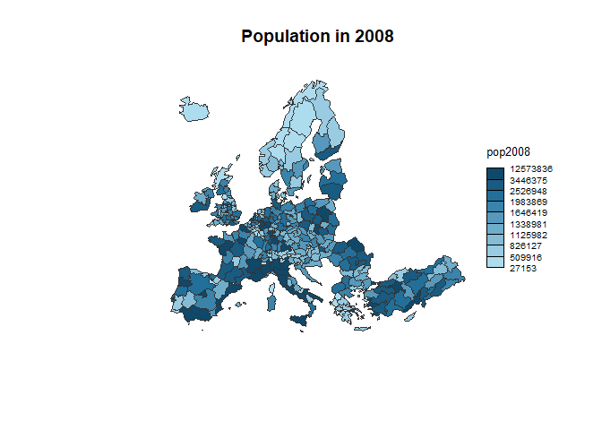

Map Visualisation
================
Apri Kamayudin Kasiran
03/08/2020

## Use data provided in the library

reference
<https://www.r-graph-gallery.com/175-choropleth-map-cartography-pkg.html>.

``` r
# Use the cartography library to do the choropleth map
library(cartography)

# Load data
data(nuts2006)

# Build a choropleth
choroLayer(spdf = nuts2.spdf, df = nuts2.df, var = "pop2008" , legend.pos = "right")
title("Population in 2008")
```

<!-- -->

## …

…
