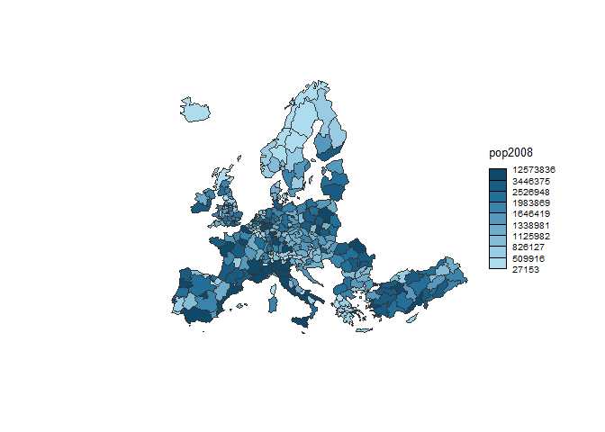

Map Visualisation
================
Apri Kamayudin
03/08/2020

## Use data provided in the library

reference
<https://www.r-graph-gallery.com/175-choropleth-map-cartography-pkg.html>.

``` r
# Use the cartography library to do the choropleth map
library(cartography)

# Load data
data(nuts2006)

# Build a choropleth
choroLayer(spdf = nuts2.spdf, df = nuts2.df, var = "pop2008" , legend.pos = "right")
title("Population in 2008")
```

<!-- -->

## Data provided in a shape file

reference
<https://www.r-graph-gallery.com/175-choropleth-map-cartography-pkg.html>

…

``` r
# Download the shape file from the web and unzip it:
download.file("http://thematicmapping.org/downloads/TM_WORLD_BORDERS_SIMPL-0.3.zip" , destfile="world_shape_file.zip")
system("unzip world_shape_file.zip")
```

    ## Warning in system("unzip world_shape_file.zip"): 'unzip' not found

    ## [1] 127

``` r
# Load it as a geospatial object in R
library(rgdal)
```

    ## Loading required package: sp

    ## rgdal: version: 1.5-12, (SVN revision 1018)
    ## Geospatial Data Abstraction Library extensions to R successfully loaded
    ## Loaded GDAL runtime: GDAL 3.0.4, released 2020/01/28
    ## Path to GDAL shared files: C:/Users/kamayudi/Documents/R/win-library/4.0/rgdal/gdal
    ## GDAL binary built with GEOS: TRUE 
    ## Loaded PROJ runtime: Rel. 6.3.1, February 10th, 2020, [PJ_VERSION: 631]
    ## Path to PROJ shared files: C:/Users/kamayudi/Documents/R/win-library/4.0/rgdal/proj
    ## Linking to sp version:1.4-2
    ## To mute warnings of possible GDAL/OSR exportToProj4() degradation,
    ## use options("rgdal_show_exportToProj4_warnings"="none") before loading rgdal.

``` r
my_spdf <- readOGR( dsn= "world_shape_file" , layer="TM_WORLD_BORDERS_SIMPL-0.3", verbose=FALSE) 
africa <- my_spdf[my_spdf@data$REGION==2 , ]

africa@data$POP2005 <- as.numeric(africa@data$POP2005)

# Use the cartography library to do the choropleth map
library(cartography)
choroLayer(spdf = africa, df = africa@data, var = "POP2005")
title("Number of people living in Africa in 2005")
```

<!-- -->
